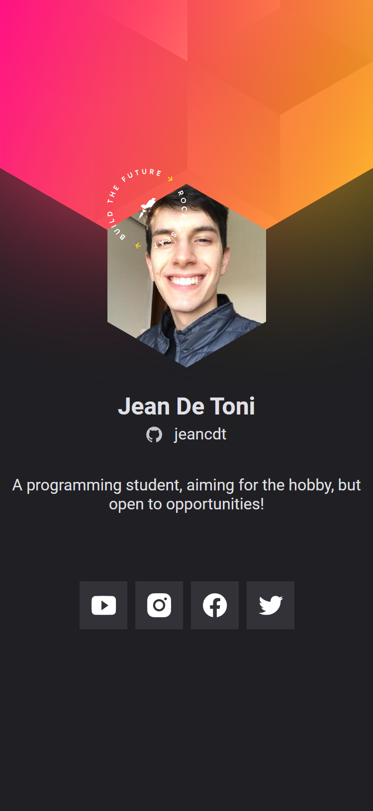
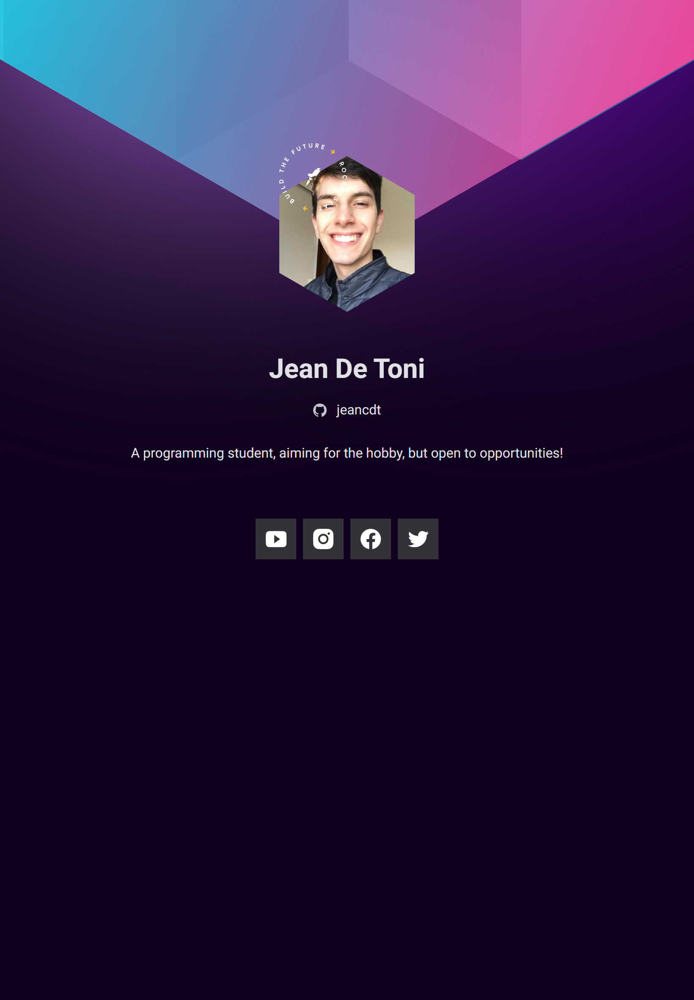
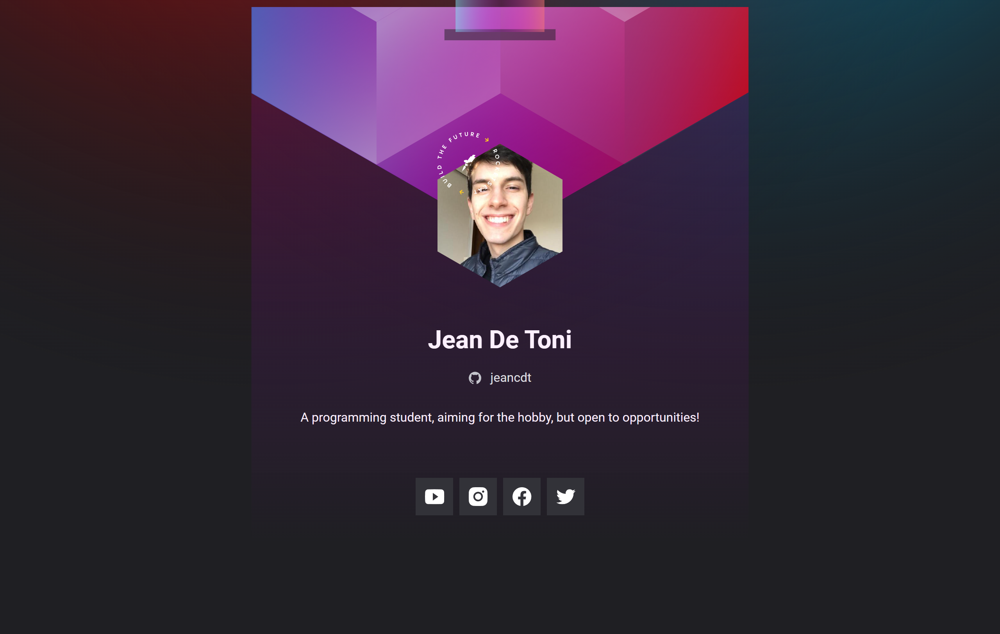

#NLW Heat Orgin - Cracha

Projeto construído como parte do conteúdo NLW Heat Origin e utilizado como primeiro aprendizado na área de JavaScript. Visando ter uma proposta de responsividade, busquei alterar as cores tanto para mobile, quanto para tablets e desktops.

[🔍 Clique aqui para acessar](https://jeancdt.github.io/cracha-nlw/)

## 📱 Preview Mobile

- Dimensionamento: iPhone SE

## 🎴 Preview Tablet

- Dimensionamento: iPad Air

## 💻 Preview Desktop

- Dimensionamento: Nest Hub Max

## ⚙ Tecnologias

- HTML
- CSS
- Git e Github
- JavaScript
- Figma

## ✍🏻 Como Utilizar

- Acesse o arquivo main.js
- Altere "const linksSocialMedia = {}" com suas informações
- O exemplo pode ser encontrado dentro do arquivo

## 💬 O que aprendi?

- Html
    - Revisar comandos
    - Tagueamento de texts/ imgs/ src
    - Aprender bons modos de escrita

- Css
    - Relembrar e memorizar comandos
    - Auxiliar em formatação de imagem
    - Auxiliar na formatação e posicionamento de blocos
    - Aprender comandos novos
    - Animação
    - Diferenciar entre phones, tablets e desktops
    - Autonomia

- Git e Github
    - Lembrar conceitos
    - Memorizar configurações

- JavaScript
    - Aprender do início
    - Conceitos básicos
    - Variáveis
    - Utilizar funções
    - Utilizar e acessar a DOM
    - Trocar links, imagens e textos

- Figma
    - Conceitos básicos
    - Modificar cores e efeitos
    - Autonomia

## ✋🏻 Atenção

Como o programa foi utilizado como aprendizado, haverá muitos comentários feitos em português, porém, caso você for utiliza-lo, basta excluir. Deixo os comentários para conseguir melhorar minha autonomia diante a algum problema futuro.

## 🙋🏻‍♂️ Contato

jeancdetoni@gmail.com